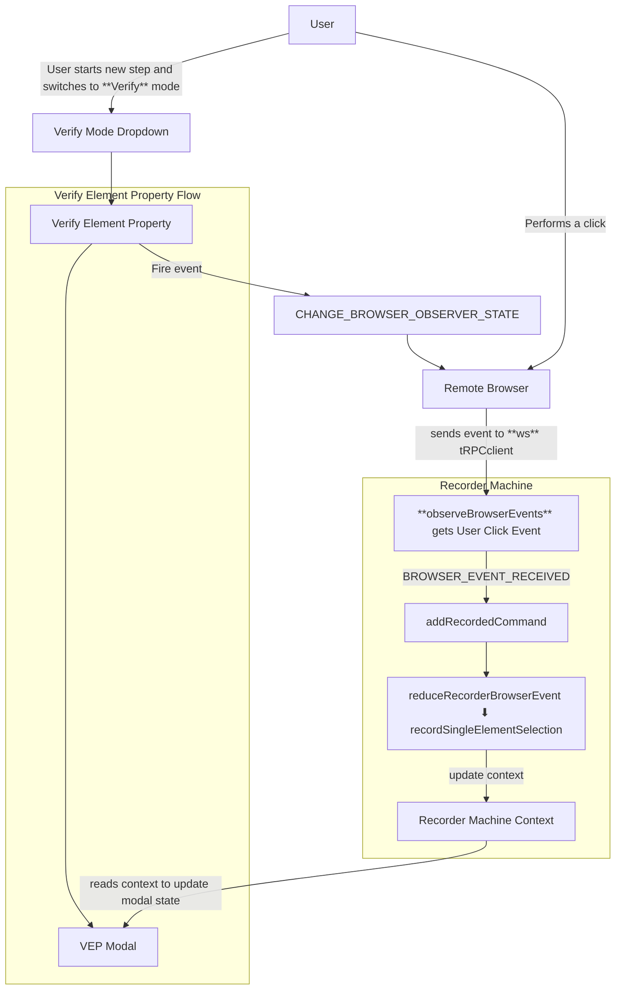

  

```mermaid

graph TD;

  

User -->|User starts new step and switches to **Verify** mode| Verify[Verify Mode Dropdown]

Verify --> VEP[Verify Element Property]

  

subgraph Verify Element Property Flow

VEP --> Modal[VEP Modal]

end

  

VEP --> |Fire event|CBOS[CHANGE_BROWSER_OBSERVER_STATE]

CBOS --> RB[Remote Browser]

User --> |Performs a click| RB[Remote Browser]

RB --> |sends event to **ws** tRPCclient| Click[**observeBrowserEvents** gets User Click Event]

subgraph Recorder Machine

  

Click --> |BROWSER_EVENT_RECEIVED| addRecordedCommand

addRecordedCommand --> Reducer[reduceRecorderBrowserEvent ⬇︎ recordSingleElementSelection]

Reducer --> |update context| Context[Recorder Machine Context]

end

Context -->|reads context to update modal state| Modal

```

- CBOS = CHANGE_BROWSER_OBSERVER_STATE

- VEP = Verify element property

- RB = remote browser

- RM = recorder machine