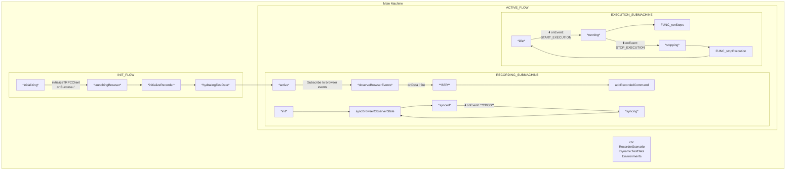

```mermaid

graph TD;

  

subgraph Main Machine

  

context["ctx:<br/>RecorderScenario<br/>DynamicTestData<br/>Environments"]

  

subgraph INIT_FLOW

*initializing* -->|initializeTRPCClient<br/>onSuccess✅| *launchingBrowser*

*launchingBrowser* --> *initializeRecorder* --> *hydratingTestData*

end

*hydratingTestData* --> *active*

subgraph ACTIVE_FLOW

subgraph RECORDING_SUBMACHINE

direction TB

*active* -->|Subscribe to browser events| *observeBrowserEvents*

*observeBrowserEvents* -->|onData ℹ️ fire| **BER** --> addRecordedCommand

*init* --> syncBrowserObserverState --> *synced* -->|⬇️ onEvent: **CBOS**| *syncing* --> syncBrowserObserverState

end

subgraph EXECUTION_SUBMACHINE

direction LR

*idle* -->|⬇️ onEvent: <br/>START_EXECUTION| *running* --> FUNC_runSteps

*running* -->|⬇️ onEvent: <br/>STOP_EXECUTION| *stopping* --> FUNC_stopExecution --> *idle*

end

end

  

end

  

```

